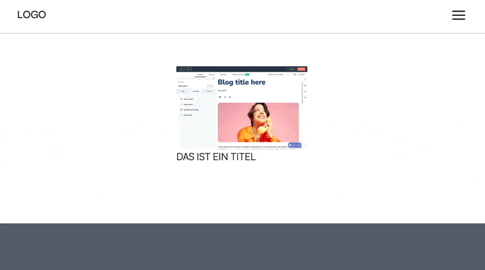

# 5AM ❤️ Storyblok + Nuxt

Look at the [Nuxt 3 documentation](https://nuxt.com/docs/getting-started/introduction) to learn more.

## Setup

Make sure to init the project by:

```
npm run init
```

This installs dependencies, and creates your local key files (.pem) for `https` (through mkcert)

## VSCode Extensions

Required Extensions:

-  [Prettier](https://marketplace.visualstudio.com/items?itemName=esbenp.prettier-vscode)

Recommended Extensions:

-  [Nuxtr](https://nuxtr.com)
-  [Tailwind IntelliSense](https://marketplace.visualstudio.com/items?itemName=bradlc.vscode-tailwindcss)

Helpful Extensions:

-  [Array Index Inlay](https://marketplace.visualstudio.com/items?itemName=antfu.array-index-inlay)

## Development Server

Start the development server on [`https://localhost:3000/`](https://localhost:3000/):

```bash
npm run dev
```

## Guides

<details>
<summary>
<h3 style="display:inline">Storyblok Revalidate Webhook</h3>
</summary><br />

This Setup uses ISR render method to achieve maximum page load speed.

ISR means, that the pages get built on first request and then cached in a CDN.

When a story is published (created or updated) there is a built-in api endpoint in this project, that triggers vercel to revalidate a specific route and cache a new version.

To do this, set up a new Webook with the URL of this project (Vercel, main-branch) and add the Endpoint `/api/revalidate`

Include all `Story` related Events in the Webhook.


</details>

<details>
<summary>
<h3 style="display:inline">GlobalSettings</h3>
</summary><br />

GlobalSettings are loaded as state via `useState<GlobalSettings>` in the default layout.

Since states are being shared globally, you can access it in any component by adding:

```
const globalSettings = useState<GlobalSettings>('global-settings')
```

</details>

<details>
<summary>
<h3 style="display:inline">Favicon</h3>
</summary><br />

Make sure you have a favicon image either as .png or as .svg. Go to [RealFaviconGenerator](https://realfavicongenerator.net/) and generate your favicon.
Replace the content of the `favicon` folder in the `public` folder with the one you downloaded.

</details>

<details>
<summary>
<h3 style="display:inline">Storyblok Images</h3>
</summary><br />

For images coming from Storyblok, use

```
<NuxtImg
	provider="storyblok"
	width="800"
	densities="x1 x2"
	:src="blok_image_filename"
	:alt="blok_image_alt" />
```

Supports:

-  format (webp, etc)
-  width / height
-  focus point
-  quality
-  fit (cover/contain, others)
-  densities (1x 2x etc)
-  lazy (loading="lazy")

[See full documentation](https://image.nuxt.com/providers/storyblok)

</details>

<details>
<summary>
<h3 style="display:inline">Auto Animate (v-auto-animate)</h3>
</summary><br />

For auto-animating `v-if` the `v-auto-animate` directive like so

```
<div v-auto-animate>
	<div v-if="<someProp>"></div>
</div>
```

This directive is given to the **parent** and will auto-animate every UI change in its **direct children**

</details>

<details>
<summary>
<h3 style="display:inline">Variables</h3>
</summary><br />

## Colors

To enable tailwind color opacity suffix (e.g. `bg-primary/70`) you need to do following:

1. When adding colors, use rgb values plain and without commas like

```
--primary-100: 113 132 223
```

2. Then wrap this variable in `rgb()` in tailwind config like so:

```
primary: {
	100: 'rgb(var(--primary-100))',
```

</details>

<details>
<summary>
<h3 style="display:inline">GSAP Directive (v-gsap)</h3>
</summary><br />

You can use `v-gsap` to define animations inline. See this example:

```
<div v-gsap.to="{ x: 50 }"></div>
```

This supports `.from`, `.to`, `.set`, `.call` and `.fromTo`, where `.fromTo` takes an array of two animation property Objects like so:

```
v-gsap.fromTo="[{ x: 0 }, { x: 50 }]"
```

⚠️ `.call` automatically includes `.once.` and only runs a single time. It takes a function as value like `.. .whenVisible.call="() => doStuff()"`

However, there are more modifiers to use:

-  `.whenVisible.`
   -  enables scrollTrigger. It defaults to from `top 90%` to `top 50%` and `scrub`
   -  you can overwrite these properties in the values Object. In `.fromTo` its the second object
   -  `.once.`: allows to run the scrollTrigger only once
   -  `.markers.`: Adds markers for development. They are only shown when NODE_ENV is `development`, so they wont make it to production
-  `.parallax.`
   -  enables parallax effect for this element. Brings its own scrollTrigger, therefore doesn't need extra `.whenVisible.`.
   -  Only works with a speed settings like:
   -  `.slower-<integer>`: Element scrolls slower than the page.
   -  `.faster-<integer>`: Element scrolls faster than the page.
   -  The value is a multiplier of 10% element height. E.g. `.slower-5` scrolls the element from +-50% to +-50% height.
   -  If the value is left out, default is `5`. Meaning: `.slower` defaults to `.slower-5` (same with faster)
-  `.stagger.`
   -  enables stagger for immediate children. Duration can be overwritten in the values Object. In `.fromTo` its the second object
-  `.infinitely.`
   -  This sets the repeat of the timeline to `-1` to infinitely repeat the animation
-  `.delay-<milliseconds>.`
   -  can be added to delay the action for n milliseconds like `.delay-500.`
   -  separated by a minus, any integer value will be accepted, like `.delay-1234.`
   -  Keep in mind that this can cause logical problems with `.whenVisible.` since it would just squeeze the following actual animation
-  `.whileHover.`
   -  lets you define a hover animation
   -  Modifier `.noReverse.` can be used for a one-way hover effect - otherwise animation will be reversed on leave
   -  is (logically) incompatible with `.whenVisible.`, therefore shoud used only by itself like: `v-gsap.whileHover.to=""`
-  `.draggable.`
   -  Allows the element to be draggable
   -  Modifiers `.x`, `.y` and `.rotation` allow to restrict the type, e.g. `v-gsap.draggable.x`
   -  Modifier `.bounds` restricts the container. If left empty like `.draggable.bounds` it uses the parent. Otherwise a querySelector can be passed like `.draggable.bounds="'.someContainer'"`
-  `.animateText.`
   -  Animates Text letter by letter
   -  It can either take a text as value like so `v-gsap.animateText="'Das ist ein Text'"`
   -  Or if no value is given, it takes the innerText from the element like so `<div v-gsap.animateText> Innerer Text </div>`
   -  Modifiers `.slow` and `.fast` change the typing speed. Example `v-gsap.animateText.slow="'Das ist ein Text'"`
-  `.magnetic`
   -  Makes an element be magnetically attracted to the cursor
   -  Supports modifiers `.stronger`, `.strong`, `.weaker`, `.weak`, where e.g. "weak" is the weakest, while "weakER" is only slightly weaker than normal
-  `.mobile.` or `.desktop.`
   -  with these you can specify the viewport on which the animation shall take place.
   -  Window resizing is handled automatically.
   -  Breakpoint is 768px, as taken from `tailwind.config`
   -  `.mobile.` only runs the animation below 768px
   -  `.desktop.` only runs the animation above 768px
   -  You can combine both. Simply use both `v-gsap.mobile.` AND `v-gsap.desktop.` on the same element.
-  `.preset.`
   -  To use an animation multiple times you can define presets in `~/app/presets/GSAPDirectivePresets.ts`
   -  Each preset has a `name`, `modifiers` and `value` (optional). This allows to prewrite the same logic as in the HTML
   -  Example:
      ```
      {
         name: 'fade-in-left',
         modifiers: 'whenVisible.from',
         value: { autoAlpha: 0, x: -32 },
      }
      ```
      Then use it like
      ```
      v-gsap.preset="'fade-in-left'"
      ```

Here's a full example of a list with scrolltrigger and stagger:

```
<ul v-gsap.whenVisible.stagger.fromTo="[{ x: 0, opacity: 0 }, { x: 50, opacity: 1 }]">
	<li>Option 1</li>
	<li>Option 2</li>
	<li>Option 3</li>
	<li>Option 4</li>
</ul>
```

`TIPP:` A useful example of a scrollTriggered Entrance Animation is:

```
v-gsap.whenVisible.from="{ x: -50, opacity: 0 }"
```

`TIPP:` You can initially hide an element with `initial-hidden` like `<div initial-hidden>`. This applies `opacity: 0`

If you need to make changes to the original code or find a bug, you can edit the code in `~/plugins/GSAPDirective.ts`

</details>

<details>
<summary>
<h3 style="display:inline">Magic Page Transitions (v-magic-transition)</h3>
</summary><br />

You can magically animate elements across pages by adding `v-magic-transition="<some-id>"`

Both elements on Page 1 and 2 need to have the same id for the Browser to connect these two in the animation.

Therefore it is recommended to find some shared value, like the `_uid` or the `image.filename` for images.

⚠️ Note: These ids need to be unique and can only occur once per page. So make sure no two elements on the same page have the same id.

Here's an example:

```

```



</details>

<details>
<summary>
<h3 style="display:inline">StoriesQuery Component</h3>
</summary><br />

For fetching Stories solely for UI purposes there is a Component named `Stories` that does the heavy lifting for you.

```
<StoriesQuery #default="{ stories, rels }">
   <pre>stories: {{ stories }}</pre>
</StoriesQuery>
```

This component takes all of the known Storyblok Query Parameters as Props:

-  `version`: 'draft' | 'published'
   -  default: uses `useSBVersion()`
-  `language`: string
   -  default: uses `useGetLanguage()`
-  `starts_with`: string
-  `sort_by`: string
   -  default: `published_at:desc`
-  `per_page`: number
   -  default: `25`
-  `page`: number
   -  default: `1`
-  `component`: string
   -  Takes a component name to filter for, typically e.g. `NewsArticle` or similar
-  `by_uuids`: string[]
   -  Takes an array of uuids to fetch
-  `search_term`
   -  Allows to search for Stories by a search_term
-  `resolve_relations`
   -  type: `string[]`
   -  define the property that you want to resolve. E.g. if a story has a field `colleague` which is of type UUID (single- or multiselect), define `:resolve_relations="['colleague']"`
   -  The resolved stories will be exposed as `rels`, which is an `Object` with the UUID as key. Therefore you can resolve inside your template by accessing it like `rels[story.colleague]`
-  `filter_query`: string
   -  Supports a full filter_query Object
-  `content_only`: boolean
   -  default: `true`
   -  Maps the stories directly to `story.content`
-  `fetchOn`:
   -  values: `'client' | 'server'` default: `'client'`
   -  If true, it fetches the stories from the client
   -  If false, the component awaits the stories before sending the HTML to the client
   -  Keep in mind, that the `#loading` template will never render when `fetchOn: 'server'`, because the data is already coming alongside the HTML
-  `filterFn`: any
   -  default: `undefined`
   -  can be used to aditionally filter the received stories.
   -  Takes a .filter Function like `:filterFn="(story) => story.component == 'Article'"`
   -  Is called _after_ the mapping from `content_only`. So keep in mind that if `content_only: false`, you'll need to use `story.content.xyz` in your filter function
-  `delay`
   -  Can be used for testing purposes like styling the loader
   -  Takes a number as `milliseconds`
-  `logs`
   -  default: `false`
   -  If enabled, logs its status changes, as well as options, response and final stories to the browser console
-  `@fetched`
   -  exposes `stories` and `rels` after it has been fetched.
   -  Use Case: e.g. if you need the uuids to exclude them elsewhere

Here's a simple example on how to use these props:

```
<StoriesQuery component="NewsArticle" :resolve_relations="['author']" #default="{ stories, rels }">
   <pre>stories: {{ stories }}</pre>
</StoriesQuery>
```

## Slot Templates

This component uses three Slots `#default`, `#loading` and `#empty`, where `#default` exposes the loaded stories like so:

```
<StoriesQuery #default="{ stories }" ...query-props-here...>
   <pre>stories: {{ stories }}</pre>
</StoriesQuery>
```

However, it is recommended that you also override the templates `#loading` and `#emtpy` with your own UI like so:

```
<StoriesQuery ...query-props-here...>
	<template #default="{ stories }">
      <pre>stories: {{ stories }}</pre>
	</template>

	<template #empty>
      <div>Empty Content here</div>
	</template>

	<template #loading>
      <div>Loading Content here</div>
	</template>
</StoriesQuery>
```

👍 PRO-TIPP: You can add `v-auto-animate` to automatically animate the entrance once stories are loaded. Like so

```
<StoriesQuery #default="{ stories }" v-auto-animate>
```

If you need to make changes or want to override a default loading or empty state, find the according component in [`~/app/components/helpers/Stories.vue`](app/components/helpers/Stories.vue)

</details>

<details>
<summary>
<h3 style="display:inline">InfiniteScroll Component</h3>
</summary><br />

The `InfiniteScroll` Component allows you to receive an event once the end is reached. You can then fetch more data that you can add.

Events:

-  `@scrollEnd`
   -  gets triggered when the scroll end is reached. This means that the end of the section has hit the `bottom` of the viewport (comparable to `bottom bottom`)
   -  `@scrollEnd` only gets called one time when the bottom is reached. If the size changes due to more data being added, it will start listening again for the next bottom-hit. If the size didnt change because there was no more data added, it wont fire again (until size changes again, e.g. due to reset). This is to ensure data fetching wont occur, even after no more data is available

Here is an example:

```
<InfiniteScroll @scrollEnd="addMoreData()">
   <div v-for="entry in data" :key="entry">{{ entry }}</div>
</InfiniteScroll>
```

</details>

<details>
<summary>
<h3 style="display:inline">useQueryRef (persist ref in URL)</h3>
</summary><br />

This custom composable allows to use a regular ref, that syncs as a URL Query Parameter. This allows to persist values in the URL, and therefore also restores a value on page load.

The value created is a regular `ref<any>()` and is set like usual with `.value =`

To create a simple QueryRef use

```
const foo = useQueryRef(<url-key>)
```

there are up to three parameters: `useQueryRef(url-key, default-value, type)`

-  `<url-key>` is the name of the prop in the url. If you want `?foo=bar` in the URL, `foo` is the key
-  `<default-value>` is an initial value that the ref should have. This is optional
-  `<type>` tells the composable how to parse the value from the URL, since URL-Params are initially always string
   -  default: `string`
   -  allowed types: `string`, `number`, `string[]`, `number[]`

Simple Example with a string values:

```
const foo = useQueryRef('foo', 'This is a value')
```

Example with a number-array:

```
const foo = useQueryRef('foo', [1,2,3], 'number[]')
```

</details>

<details>
<summary>
<h3 style="display:inline">ShadCn Components</h3>
</summary><br />

ShadCn Components come preconfigured.

## Go to [ShadCn Vue](https://www.shadcn-vue.com/) to find Compents.

## Component Installation

-  Install the component via the provided command. Like: `npx shadcn-vue@latest add button`
-  Use the component and include the import in the script setup tag like `import { Button } from '@/components/ui/button'`. You can simply copy the import from the docs, all paths will match up automatically via predefined alias.

</details>

<details>
<summary>
<h3 style="display:inline">Tailwind Container Queries</h3>
</summary><br />

ShadCn Components come preconfigured.

## Go to [TW Container Queries](https://github.com/tailwindlabs/tailwindcss-container-queries) to find see how it works.

## Basic usage

The parent gets `@container` or if specified name `@container/<some-name>`.
The children can then react to its parent size by `@lg:bg-red-500`

🚨 TW Container Queries can not yet be deeply modified in tailwind.config.js. Therefore the breakpoints are upwards, not downwards like our viewport-breakpoints. Meaning: `@lg:` will take action `above` lg-breakpoint, not below. Think mobile-first to write container queries

Example:

```
<div class="w-[500px] @container">
   <div class="grid grid-cols-2 gap-8 w-full @lg:grid-cols-1">
      " class="w-full" alt="" />
      " class="w-full" alt="" />
   </div>
</div>
```

</details>

<details>
<summary>
<h3 style="display:inline">NumberFlow</h3>
</summary><br />

Usage:

`<NumberFlow value="123" />`

also you need to import the component: `import NumberFlow from '@number-flow/vue'`

[Read the Docs](https://number-flow.barvian.me/vue)

</details>

## Change logs

-  allow subfolders for components (Path needs to be included in Name when using)
-  added lint-staged commit hook that uses prettier after every commit
-  fixed hotreload bug where Storyblok changes would require "Save" (now updates immediately)
-  fixed sitemap
-  added StoryblokHelper in dev mode that opens that exact page in Storyblok (in new tab)
-  added nuxt-security module with exception for Storyblok iframe
-  change scss-variables to rgb components for tailwind opacities
-  added nuxt/test-utils with default SEO tests
-  refactored to use default layout (previously no layout)
-  added NuxtLazyHydrate to Page.vue to hydrate each section when-visible (for Lighthouse Score)
-  added Lenis for Smooth Scrolling
-  added ShadCn (Nuxt)
-  added Tailwind Container Queries
-  added NumberFlow
-  added ISR with `api/revalidate` Endpoint for Storyblok
-  added <Welcome /> Component
